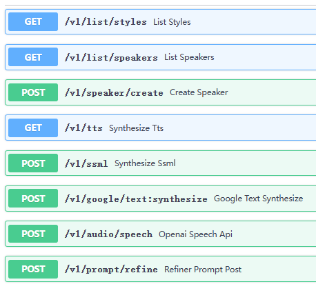
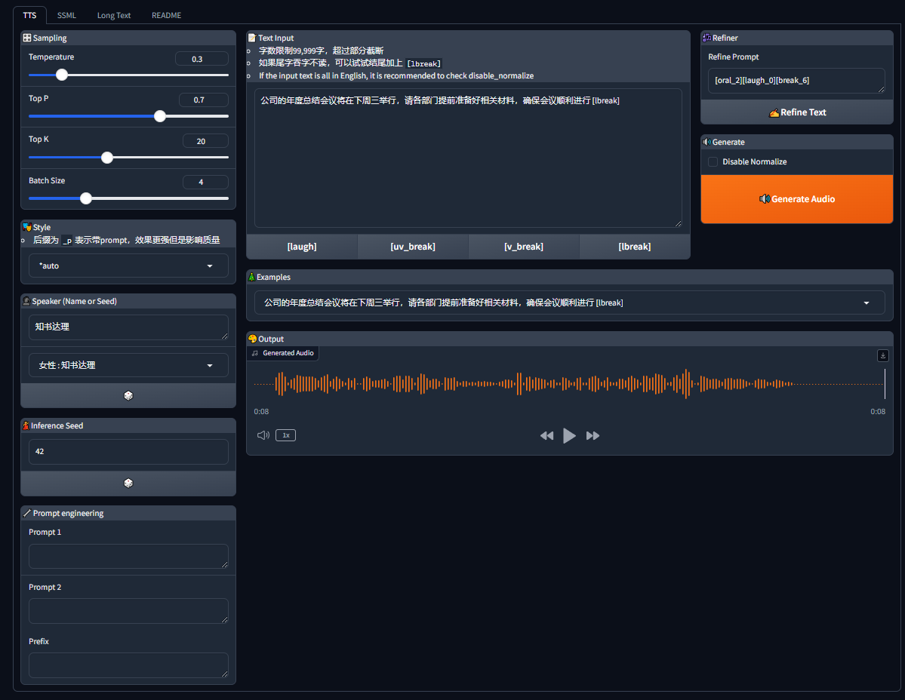
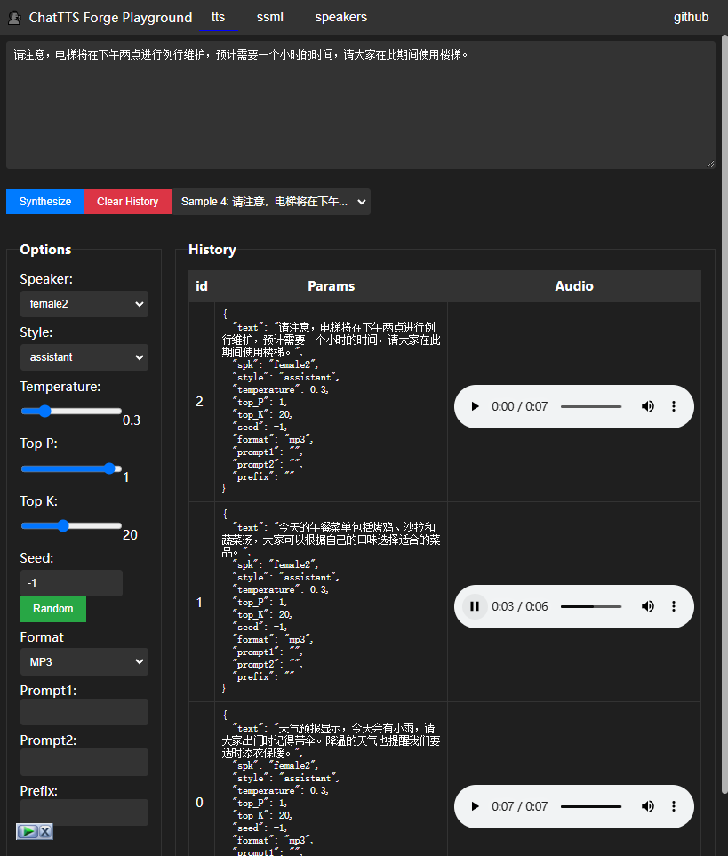

# 🗣️ ChatTTS-Forge

ChatTTS 锻造厂提供强大的 ChatTTS API，支持类 SSML 语法生成长文本，并能高效管理和复用说话人和风格。

在线试用：
https://huggingface.co/spaces/lenML/ChatTTS-Forge

# Features

- **风格提示词注入**: 灵活调整输出风格，通过注入提示词实现个性化。
- **全面的 API 服务**: 所有功能均通过 API 访问，集成方便。
- **友好的调试 GUI**: 独立于 Gradio 的 playground，简化调试流程。
- **OpenAI 风格 API**: `/v1/openai/audio/speech` 提供类似 OpenAI 的语音生成接口。
- **Google 风格 API**: `/v1/google/text:synthesize` 提供类似 Google 的文本合成接口。
- **类 SSML 支持**: 使用类 SSML 语法创建丰富的音频长文本。
- **说话人管理**: 通过名称或 ID 高效复用说话人。
- **风格管理**: 通过名称或 ID 复用说话风格，内置 32 种不同风格。
- **文本标准化**: 针对 ChatTTS 优化的文本标准化，解决大部分不支持的 token。
- **独立 refine API**: 提供单独的 refine 调试接口，提升调试效率。
- **高效缓存机制**: 生成接口采用 LRU 缓存，提升响应速度。

# Useage

## 环境准备

1. clone: `git clone https://github.com/lenML/ChatTTS-Forge.git`
2. model: 请在此地址下载手动下载模型，并放置到 models/ChatTTS 目录下

   - HuggingFace: https://huggingface.co/2Noise/ChatTTS

     

3. python: `python -m pip -r requirements.txt`
4. ffmpeg: 加速减速变声依赖于 ffmpeg，部署环境中需要安装 ffmpeg

> 显存消耗估计在 3.7gb 左右

## 启动项目

```
python launch.py
```

## Argument Description

| Parameter       | Type   | Default     | Description                                                             |
| --------------- | ------ | ----------- | ----------------------------------------------------------------------- |
| `--host`        | `str`  | `"0.0.0.0"` | Host to run the server on                                               |
| `--port`        | `int`  | `8000`      | Port to run the server on                                               |
| `--reload`      | `bool` | `False`     | Enable auto-reload for development                                      |
| `--compile`     | `bool` | `False`     | Enable model compile                                                    |
| `--lru_size`    | `int`  | `64`        | Set the size of the request cache pool; set to 0 to disable `lru_cache` |
| `--cors_origin` | `str`  | `"*"`       | Allowed CORS origins. Use `*` to allow all origins                      |

# API

部署后打开 `http://localhost:8000/docs` 可查看详细信息



# WebUI

> 某些情况可能需要 webui（比如白嫖 huggingface） ，这里实现了一个最简单的版本

```
python webui.py
```



# Playground

实现了一套用于调试 api 的 playground 前端页面，独立于 python 代码非 gradio

部署后打开 `http://localhost:8000/playground/index.html` 即可使用



# ChatTTS-SSML v0.1

> 这是一个实验性质的尝试，现在并没用完整的 SSML 语法和功能。

ChatTTS-SSML 是类似 微软 tts 的那种格式，结合本系统中的 speaker 和 style 会很好用

下面是一个简单的例子

```xml
<speak version="0.1">
    <voice spk="Bob" style="narration-relaxed">
        ChatTTS 用于合成多角色多情感的有声书示例
    </voice>
    <voice spk="Bob" style="narration-relaxed">
        黛玉冷笑道：
    </voice>
    <voice spk="female2" style="angry">
        我说呢 [uv_break] ，亏了绊住，不然，早就飞起来了。
    </voice>
    <voice spk="Bob" style="narration-relaxed">
        宝玉道：
    </voice>
    <voice spk="Alice" style="unfriendly">
        “只许和你玩 [uv_break] ，替你解闷。不过偶然到他那里，就说这些闲话。”
    </voice>
    <voice spk="female2" style="angry">
        “好没意思的话！[uv_break] 去不去，关我什么事儿？ 又没叫你替我解闷儿 [uv_break]，还许你不理我呢”
    </voice>
    <voice spk="Bob" style="narration-relaxed">
        说着，便赌气回房去了。
    </voice>
</speak>
```

[ssml_demo.webm](https://github.com/lenML/ChatTTS-Forge/assets/37396659/b2434702-1e3c-4e2a-ae94-2012897e16d7)

## prosody

> 受限于模型能力，暂时无法做到对单个字控制。尽量在一个 prosody 中用长文本效果更好。

prosody 和 voice 一样接收所有语音控制参数，除此之外还可以控制 rate volume pitch 以对生成语音进行细致的后处理。

一个例子如下

```xml
<speak version="0.1">
    <voice spk="Bob" style="narration-relaxed">
        使用 prosody 控制生成文本的语速语调和音量，示例如下

        <prosody>
            无任何限制将会继承父级voice配置进行生成
        </prosody>
        <prosody rate="1.5">
            设置 rate 大于1表示加速，小于1为减速
        </prosody>
        <prosody pitch="6">
            设置 pitch 调整音调，设置为6表示提高6个半音
        </prosody>
        <prosody volume="2">
            设置 volume 调整音量，设置为2表示提高2个分贝
        </prosody>

        在 voice 中无prosody包裹的文本即为默认生成状态下的语音
    </voice>
</speak>
```

[prosody_demo.webm](https://github.com/lenML/ChatTTS-Forge/assets/37396659/b5ad4c8d-f519-4b9a-bacf-290e4cc7d6df)

## break

空白，用于在文本中插入固定时长的空白停顿

```xml
<speak version="0.1">
    <voice spk="Bob" style="narration-relaxed">
        使用 break 标签将会简单的

        <break time="500" />

        插入一段空白到生成结果中
    </voice>
</speak>
```

[break_demo.webm](https://github.com/lenML/ChatTTS-Forge/assets/37396659/e1c682b8-fce1-40fa-a4bf-7465a266798a)

# styles list

> 暂时还没有找到特别稳定的 prompt 方法，使用 style 时可能导致输出质量下降

| 风格                      | 说明                                                                                               |
| ------------------------- | -------------------------------------------------------------------------------------------------- |
| advertisement_upbeat      | 用兴奋和精力充沛的语气推广产品或服务。                                                             |
| affectionate              | 以较高的音调和音量表达温暖而亲切的语气。说话者处于吸引听众注意力的状态。说话者的个性往往是讨喜的。 |
| angry                     | 表达生气和厌恶的语气。                                                                             |
| assistant                 | 数字助理用的是热情而轻松的语气。                                                                   |
| calm                      | 以沉着冷静的态度说话。语气、音调和韵律与其他语音类型相比要统一得多。                               |
| chat                      | 表达轻松随意的语气。                                                                               |
| cheerful                  | 表达积极愉快的语气。                                                                               |
| customerservice           | 以友好热情的语气为客户提供支持。                                                                   |
| depressed                 | 调低音调和音量来表达忧郁、沮丧的语气。                                                             |
| disgruntled               | 表达轻蔑和抱怨的语气。这种情绪的语音表现出不悦和蔑视。                                             |
| documentary-narration     | 用一种轻松、感兴趣和信息丰富的风格讲述纪录片，适合配音纪录片、专家评论和类似内容。                 |
| embarrassed               | 在说话者感到不舒适时表达不确定、犹豫的语气。                                                       |
| empathetic                | 表达关心和理解。                                                                                   |
| envious                   | 当你渴望别人拥有的东西时，表达一种钦佩的语气。                                                     |
| excited                   | 表达乐观和充满希望的语气。似乎发生了一些美好的事情，说话人对此满意。                               |
| fearful                   | 以较高的音调、较高的音量和较快的语速来表达恐惧、紧张的语气。说话人处于紧张和不安的状态。           |
| friendly                  | 表达一种愉快、怡人且温暖的语气。听起来很真诚且满怀关切。                                           |
| gentle                    | 以较低的音调和音量表达温和、礼貌和愉快的语气。                                                     |
| hopeful                   | 表达一种温暖且渴望的语气。听起来像是会有好事发生在说话人身上。                                     |
| lyrical                   | 以优美又带感伤的方式表达情感。                                                                     |
| narration-professional    | 以专业、客观的语气朗读内容。                                                                       |
| narration-relaxed         | 为内容阅读表达一种舒缓而悦耳的语气。                                                               |
| newscast                  | 以正式专业的语气叙述新闻。                                                                         |
| newscast-casual           | 以通用、随意的语气发布一般新闻。                                                                   |
| newscast-formal           | 以正式、自信和权威的语气发布新闻。                                                                 |
| poetry-reading            | 在读诗时表达出带情感和节奏的语气。                                                                 |
| sad                       | 表达悲伤语气。                                                                                     |
| serious                   | 表达严肃和命令的语气。说话者的声音通常比较僵硬，节奏也不那么轻松。                                 |
| shouting                  | 表达一种听起来好像声音在远处或在另一个地方的语气，努力让别人听清楚。                               |
| sports_commentary         | 表达一种既轻松又感兴趣的语气，用于播报体育赛事。                                                   |
| sports_commentary_excited | 用快速且充满活力的语气播报体育赛事精彩瞬间。                                                       |
| whispering                | 表达一种柔和的语气，试图发出安静而柔和的声音。                                                     |
| terrified                 | 表达一种害怕的语气，语速快且声音颤抖。听起来说话人处于不稳定的疯狂状态。                           |
| unfriendly                | 表达一种冷淡无情的语气。                                                                           |

# Docker

WIP 开发中

# References

- ChatTTS: https://github.com/2noise/ChatTTS
- PaddleSpeech: https://github.com/PaddlePaddle/PaddleSpeech
