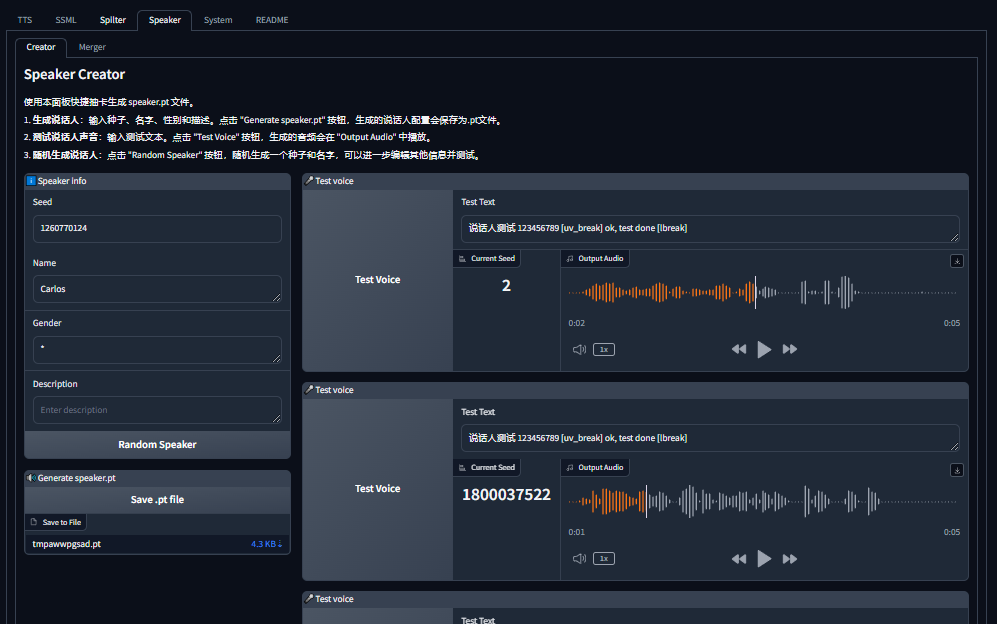

# WebUI Features

## webui.py

`webui.py` 是一个用于配置和启动 Gradio Web UI 界面的脚本。

```
usage: webui.py [-h] [--server_name SERVER_NAME] [--server_port SERVER_PORT] [--share] [--debug] [--auth AUTH] [--tts_max_len TTS_MAX_LEN]
                [--ssml_max_len SSML_MAX_LEN] [--max_batch_size MAX_BATCH_SIZE] [--webui_experimental] [--language LANGUAGE] [--api]
                [--off_track_tqdm] [--compile] [--flash_attn] [--no_half] [--off_tqdm] [--device_id DEVICE_ID]
                [--use_cpu {all,chattts,enhancer,trainer} [{all,chattts,enhancer,trainer} ...]] [--lru_size LRU_SIZE] [--debug_generate]
                [--preload_models] [--cors_origin CORS_ORIGIN] [--no_playground] [--no_docs] [--exclude EXCLUDE]

Gradio App

options:
  -h, --help            show this help message and exit
  --server_name SERVER_NAME
                        server name
  --server_port SERVER_PORT
                        server port
  --share               share the gradio interface
  --debug               enable debug mode
  --auth AUTH           username:password for authentication
  --tts_max_len TTS_MAX_LEN
                        Max length of text for TTS
  --ssml_max_len SSML_MAX_LEN
                        Max length of text for SSML
  --max_batch_size MAX_BATCH_SIZE
                        Max batch size for TTS
  --webui_experimental  Enable webui_experimental features
  --language LANGUAGE   Set the default language for the webui
  --api                 use api=True to launch the API together with the webui (run launch.py for only API server)
  --off_track_tqdm      turn off track_tqdm
  --compile             Enable model compile
  --flash_attn          Enable flash attention
  --no_half             Disalbe half precision for model inference
  --off_tqdm            Disable tqdm progress bar
  --device_id DEVICE_ID
                        Select the default CUDA device to use (export CUDA_VISIBLE_DEVICES=0,1,etc might be needed before)
  --use_cpu {all,chattts,enhancer,trainer} [{all,chattts,enhancer,trainer} ...]
                        use CPU as torch device for specified modules
  --lru_size LRU_SIZE   Set the size of the request cache pool, set it to 0 will disable lru_cache
  --debug_generate      Enable debug mode for audio generation
  --preload_models      Preload all models at startup
  --cors_origin CORS_ORIGIN
                        Allowed CORS origins. Use '*' to allow all origins.
  --no_playground       Disable the playground entry
  --no_docs             Disable the documentation entry
  --exclude EXCLUDE     Exclude the specified API from the server
```

tips:

- 所有参数均可在 .env.webui 中以大写形式配置 （比如 no_docs => NO_DOCS）
- 在命令行之后的参数优先级高于 .env 参数
- 从 webui.py 入口启动， 可与 api 同时启动，api 的配置在下方 launch.py 脚本参数中说明， 开启后可在 `http://localhost:7860/docs` 查看 api
- 由于 `MKL FFT doesn't support tensors of type: Half` 所以 `--use_cpu="all"` 时需要开启 `--no_half`

## TTS

该页面提供了一个强大的对话式文本转语音（TTS）模型接口，支持中英文混读和多说话人能力。用户可以通过调节各种参数生成高质量的语音输出。

### 使用流程

1. **采样参数设置**

   - **温度（Temperature）**: 使用滑块调整，范围 0.01 到 2.0，默认值为 0.3。
   - **Top P**: 使用滑块调整，范围 0.1 到 1.0，默认值为 0.7。
   - **Top K**: 使用滑块调整，范围 1 到 50，默认值为 20。
   - **批处理大小（Batch Size）**: 使用滑块调整，范围 1 到最大批处理大小，默认值为 4。

2. **风格选择**

   - 选择样式（Style）: 从下拉菜单中选择预设样式，默认值为`*auto`。

3. **说话人选择**

   - **选择说话人**: 可以从下拉菜单中选择预设说话人，或手动输入说话人名称或种子。
   - **上传说话人文件**: 通过上传文件来自定义说话人。

4. **推理种子**

   - 设置推理种子（Inference Seed），可以手动输入或点击按钮随机生成。

5. **Prompt 工程**

   - 输入 Prompt 1、Prompt 2 和前缀（Prefix）。
   - 上传音频提示（如果启用了实验性功能）。

6. **文本输入**

   - 输入需要转换的文本，注意字数限制和英文文本的特殊标记。

7. **示例选择**

   - 从下拉菜单中选择示例文本，快速填充输入框。

8. **生成音频**

   - 点击“生成音频”（Generate Audio）按钮，生成语音输出。
   - 可选：启用增强（Enhance）和去噪（De-noise）功能。

9. **文本优化**
   - 输入优化提示（Refine Prompt），点击优化文本（Refine Text）按钮，对文本进行优化。


## SSML

🚧 施工中

## Spliter

🚧 施工中

## Speaker

### Speaker Creator

使用本面板快捷抽卡生成 speaker.pt 文件。

1. **生成说话人**：输入种子、名字、性别和描述。点击 "Generate speaker.pt" 按钮，生成的说话人配置会保存为.pt 文件。
2. **测试说话人声音**：输入测试文本。点击 "Test Voice" 按钮，生成的音频会在 "Output Audio" 中播放。
3. **随机生成说话人**：点击 "Random Speaker" 按钮，随机生成一个种子和名字，可以进一步编辑其他信息并测试。



### Speaker Merger

在本面板中，您可以选择多个说话人并指定他们的权重，合成新的语音并进行测试。以下是各个功能的详细说明：

1. 选择说话人: 您可以从下拉菜单中选择最多四个说话人（A、B、C、D），每个说话人都有一个对应的权重滑块，范围从 0 到 10。权重决定了每个说话人在合成语音中的影响程度。
2. 合成语音: 在选择好说话人和设置好权重后，您可以在“Test Text”框中输入要测试的文本，然后点击“测试语音”按钮来生成并播放合成的语音。
3. 保存说话人: 您还可以在右侧的“说话人信息”部分填写新的说话人的名称、性别和描述，并点击“Save Speaker”按钮来保存合成的说话人。保存后的说话人文件将显示在“Merged Speaker”栏中，供下载使用。


## FQA

1. 如何增加文本上限？
   配置 `.env.webui` 环境变量文件即可
